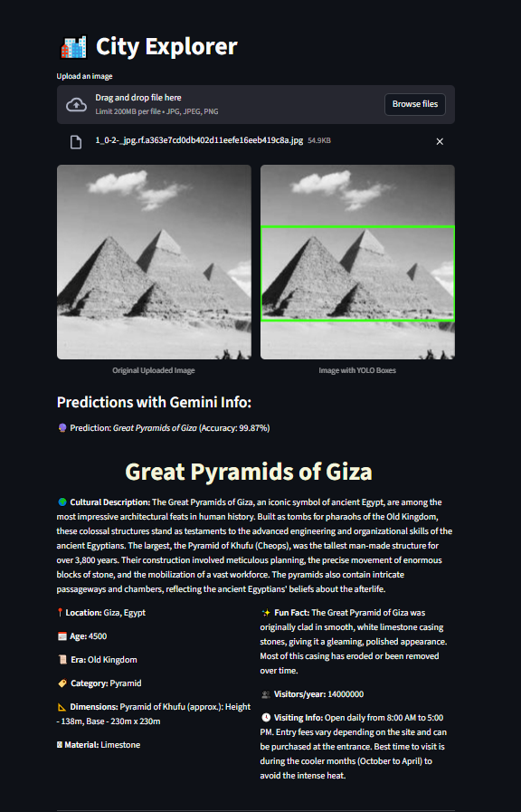

# Egyptian Landmarks Detection and Classification

A comprehensive computer vision project that combines YOLO object detection with CNN classification to identify and classify Egyptian landmarks and artifacts.

## 🏛️ Project Overview

This project implements a two-stage pipeline:
1. **Object Detection**: Uses YOLO11 to detect landmarks/artifacts in images
2. **Classification**: Uses ResNet-18 to classify detected objects into 35 Egyptian landmark categories

### Key Features
- **35 Egyptian Landmark Classes**: From Great Pyramids to ancient statues
- **End-to-end Pipeline**: From data download to trained models
- **Modular Architecture**: Well-organized, reusable code structure
- **Google Colab Support**: Designed for easy deployment on Colab

## 📁 Project Structure

```
egyptian-landmarks/
├── config.py                 # Configuration settings
├── data_downloader.py         # Dataset download utilities
├── data_processor.py          # Dataset processing and organization
├── yolo_trainer.py           # YOLO model training
├── classification_trainer.py  # CNN classification training
├── utils.py                  # Utility functions
├── main.py                   # Main pipeline 
├── models                  # saved model
|   ├── best.pt                   # Main pipeline 
|   ├── egyptian_landmarks_classification_model.pth     # classification model
├── app.py                    # Streamlit web application
├── requirements.txt          # Project dependencies
├── .env.example              # Environment variables template
├── deployment.md             # Deployment guide
└── README.md                # Project documentation
```

## 🚀 Quick Start

### 1. Installation
```bash
# Install dependencies
pip install -r requirements.txt
```

### 2. Run Full Pipeline
```bash
# Run complete pipeline (download → process → train YOLO → train classifier)
python main.py --mode full
```

### 3. Run Web Application



```bash
# Set up environment variables
cp .env.example .env
# Edit .env with your API keys

# Run Streamlit app
streamlit run app.py


```

### 4. Individual Steps
```bash
# Download dataset only
python main.py --mode download

# Process dataset only
python main.py --mode process

# Train YOLO only
python main.py --mode train_yolo

# Train classifier only
python main.py --mode train_classifier
```

### 4. Inference
```bash
# Run inference on single image
python main.py --mode inference --image_path path/to/image.jpg
```

## 🛠️ Configuration

All configuration settings are centralized in `config.py`:

- **Dataset settings**: Roboflow API configuration
- **Model parameters**: YOLO and CNN training settings
- **Paths**: File and directory paths
- **Class names**: 35 Egyptian landmark categories

## 📊 Dataset

The project uses a custom Egyptian landmarks dataset with 35 classes:

### Sample Classes:
- Great Pyramids of Giza
- Sphinx
- Mask of Tutankhamun
- Nefertiti
- Various pharaoh statues and artifacts

### Dataset Statistics:
- **Images**: Thousands of labeled landmark images
- **Classes**: 35 distinct Egyptian landmarks/artifacts
- **Format**: YOLO format for object detection
- **Split**: 80% training, 20% testing

## 🎯 Model Architecture

### YOLO Detection Model
- **Architecture**: YOLO11n (nano version for efficiency)
- **Purpose**: Detect landmarks/artifacts in images
- **Output**: Bounding boxes with class predictions

### Classification Model
- **Architecture**: ResNet-18 with custom classifier head
- **Purpose**: Fine-grained classification of detected objects
- **Training**: Transfer learning from ImageNet

## 📈 Results

### YOLO Performance
- Trained for 18 epochs
- Confidence threshold: 0.25
- Detects multiple objects per image

### Classification Performance
- ResNet-18 backbone with 35-class output
- Trained for 14 epochs
- Evaluation on both training and validation sets

## 🔧 Usage Examples

### Basic Usage
```python
from main import EgyptianLandmarksPipeline

# Initialize pipeline
pipeline = EgyptianLandmarksPipeline()

# Run full pipeline
pipeline.run_full_pipeline()

# Run inference
results = pipeline.run_inference_only('path/to/image.jpg')
```

### Individual Components
```python
# YOLO training
from yolo_trainer import YOLOTrainer
trainer = YOLOTrainer()
trainer.train_model()

# Classification training
from classification_trainer import ClassificationTrainer
classifier = ClassificationTrainer()
classifier.setup_datasets()
classifier.train_model()
```

## 📱 Google Colab Integration

The project is optimized for Google Colab:

1. Upload all `.py` files to Colab
2. Install requirements: `!pip install -r requirements.txt`
3. Run pipeline: `!python main.py --mode full`

### Colab-Specific Features:
- Automatic file downloads via `google.colab.files`
- GPU/TPU support detection
- Checkpoint saving and downloading

## 🌐 Web Application Features

### Interactive Streamlit Interface
- **Upload & Analyze**: Drag and drop images for instant analysis
- **Dual-Model Pipeline**: YOLO detection → ResNet classification
- **Rich Information**: AI-powered cultural descriptions via Gemini
- **Visual Results**: Side-by-side original and annotated images
- **Detailed Insights**: Historical facts, visiting information, and cultural context

### Demo Features

The project includes visualization utilities:

- Training history plots
- Prediction visualizations
- Class distribution analysis
- Model performance metrics

## 📋 Requirements

### System Requirements:
- Python 3.7+
- CUDA-compatible GPU (recommended)
- 8GB+ RAM

### Key Dependencies:
- PyTorch & Torchvision
- Ultralytics YOLO
- Roboflow
- OpenCV, PIL
- Scikit-learn

## 🤝 Contributing

1. Fork the repository
2. Create your feature branch
3. Make changes and test thoroughly
4. Submit a pull request

## 📄 License

This project is licensed under the MIT License - see the LICENSE file for details.

## 🙏 Acknowledgments

- Dataset provided via Roboflow platform
- YOLO implementation by Ultralytics
- PyTorch team for the deep learning framework
- Egyptian heritage preservation community

## 📞 Support

For questions or support:
- Create an issue in the repository
- Check the documentation in each module
- Review the configuration settings in `config.py`

---

**Happy landmark hunting! 🏛️✨**